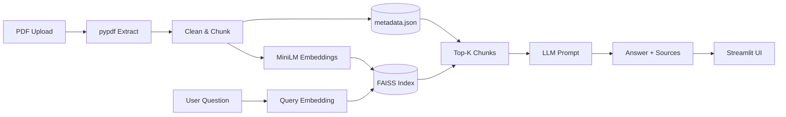

# Enterprise GenAI RAG Assistant

A beginner-friendly, production-structured **Retrieval-Augmented Generation (RAG)** application in Python. Upload PDFs, ask questions in natural language, and get answers **grounded in your documents** with **source file and page citations**.

---

## Project overview

Organizations store policies, handbooks, and reports in PDFs. Generic chatbots can hallucinate or ignore internal documents. This project implements a real RAG pipeline: extract text → chunk → embed → store in **FAISS** → retrieve relevant chunks → send only that context to an **LLM** → show answers with citations.

**Portfolio focus:** Data Analyst / AI / GenAI / ML roles — easy to run, explain, and extend.

---

## Problem statement

- LLMs alone do not know your private PDFs.
- Sending entire PDFs to an LLM is expensive and hits context limits.
- Users need **trust**: answers must cite **which document and page** supported the response.

RAG solves this by retrieving small, relevant excerpts before generation.

---

## What is RAG?

**Retrieval-Augmented Generation** combines:

1. **Retrieval** — find the most relevant pieces of your documents for a question (vector similarity search).
2. **Augmentation** — put those pieces into the LLM prompt as context.
3. **Generation** — the LLM writes an answer using **only** that context.

If nothing relevant is found, the app instructs the model to say it could not find the information.

---

## How this project works

```text
PDF Upload
    ↓
PDF Text Extraction (pypdf)
    ↓
Document Cleaning
    ↓
Text Chunking (word-based, overlap)
    ↓
Embedding Generation (sentence-transformers)
    ↓
FAISS Vector Index + JSON metadata
    ↓
User Question
    ↓
Question Embedding
    ↓
Similarity Search (top-K)
    ↓
Prompt Construction
    ↓
LLM (OpenAI-compatible API)
    ↓
Grounded Answer + Source/Page Citations
    ↓
Streamlit UI
```

### Architecture (Mermaid)



---

## Technology stack

| Layer | Tool |
|--------|------|
| UI | Streamlit |
| PDF | pypdf |
| Embeddings | sentence-transformers (`all-MiniLM-L6-v2`) |
| Vector DB | FAISS (local, `faiss-cpu`) |
| Numerics | NumPy |
| LLM | OpenAI-compatible HTTP API (`requests`) |
| Config | python-dotenv |

**No LangChain** — core RAG steps are implemented manually so you can explain each stage in interviews.

---

## Project structure

```text
enterprise-genai-rag/
├── data/
│   ├── uploads/          # Saved uploaded PDFs (gitignored contents)
│   └── processed/        # vector.index + metadata.json
├── src/
│   ├── config.py         # Paths, env vars, defaults
│   ├── pdf_loader.py     # PDF → pages with metadata
│   ├── text_processor.py # Clean + chunk
│   ├── embeddings.py     # SentenceTransformer wrappers
│   ├── vector_store.py   # FAISS + JSON metadata
│   ├── retriever.py      # Top-K similarity search
│   ├── llm.py            # OpenAI-compatible client
│   ├── rag_pipeline.py   # End-to-end answer_question()
│   └── utils.py          # Logging, validation
├── app.py                # Streamlit application
├── tests/
├── requirements.txt
├── .env.example
└── README.md
```

---

## Installation

### 1. Prerequisites

- **Python 3.11+**
- Internet for first run (downloads embedding model ~90MB)
- An **LLM API key** (OpenAI or any OpenAI-compatible provider)

### 2. Clone / open project

```bash
cd Enterprise_Rag_Asisstant
```

### 3. Virtual environment

**Windows (PowerShell):**

```powershell
python -m venv venv
venv\Scripts\activate
```

**macOS / Linux:**

```bash
python -m venv venv
source venv/bin/activate
```

### 4. Install dependencies

```bash
pip install -r requirements.txt
```

### 5. API key configuration

Copy the example env file and edit it:

**Windows:**

```powershell
copy .env.example .env
```

**macOS / Linux:**

```bash
cp .env.example .env
```

Edit `.env`:

```env
LLM_API_KEY=your_real_key_here
LLM_MODEL=gpt-4o-mini
```

Optional: set `LLM_BASE_URL` for Groq, Together, Azure OpenAI-compatible endpoints, or local servers.

**Never commit `.env`.**

---

## Run the application

```bash
streamlit run app.py
```

Open the URL shown in the terminal (usually `http://localhost:8501`).

---

## Using the app

1. **Sidebar → Upload PDF files** (one or many).
2. Click **Process Documents** — extracts text, chunks, embeds, builds FAISS index.
3. Adjust **Top K** and **Similarity threshold** if needed.
4. Ask a question in the chat box.
5. Read the **answer** and **Sources** (filename + page number from PDF metadata).

On restart, if `data/processed/vector.index` exists, the app reloads the index automatically.

---

## How retrieval works

1. Your question is converted to a 384-dimensional vector (same model as documents).
2. FAISS finds the **top-K** nearest chunk vectors (cosine similarity via normalized inner product).
3. Chunks with score below the **similarity threshold** are dropped so weak matches are not sent to the LLM.
4. Remaining excerpts are formatted with `source` and `page` in the prompt.

---

## How embeddings work

- Model: `all-MiniLM-L6-v2` (lightweight, good for portfolios and laptops).
- Each chunk of text → fixed-size float vector capturing **semantic meaning**.
- Similar questions and similar passages get vectors that are **close** in vector space.

---

## How FAISS works

- **FAISS** stores all chunk embeddings in a fast index on disk (`data/processed/vector.index`).
- Chunk text and metadata live in `metadata.json`; **row index in FAISS = index in JSON** (must stay aligned).
- Search is local and free — no cloud vector DB required for this version.

---

## How the LLM works

- The app calls `/v1/chat/completions` with a **strict system prompt**: answer only from provided context.
- If the key is missing, you get a clear message to configure `.env` — no fake answers.
- Recent chat turns are included so simple follow-up questions work.

---

## Source citations

Citations come from chunk metadata at retrieval time (`source` filename, `page` from pypdf). The UI lists unique source/page pairs used in the retrieved context — **not invented page numbers**.

---

## Example questions

After uploading HR/policy PDFs:

- “How many annual leave days do employees get?”
- “What is the work-from-home policy?”
- “What is the capital of France?” → should respond that the information is **not in the documents** (if not present).

Follow-up:

- “Can unused leave be carried over?” (after a leave question)

---

## Limitations

- PDFs that are **scanned images** without a text layer may yield no text.
- Chunking is simple (fixed word size + overlap) — no table-aware or layout parsing.
- No reranking or hybrid (keyword + vector) search yet.
- LLM quality and cost depend on your API provider.
- Conversation memory is **short** (recent turns only), not a full enterprise memory system.

---

## Future improvements

Designed for later extension (not implemented here):

- Cloud vector stores (Snowflake, Databricks Vector Search, Pinecone, etc.)
- Snowflake Cortex / Databricks Mosaic AI / Genie / Agent Bricks integrations
- Rerankers, hybrid search, evaluation (RAGAS, etc.)
- OCR for scanned PDFs
- Role-based document access

---

## Run tests

```bash
pytest
```

Tests cover PDF error handling, chunk metadata, and retrieval result shape (with a fake embedding model in tests to avoid heavy downloads in CI).

---

## How I explain this project in an interview (60 seconds)

“I built an enterprise-style RAG assistant in Python. Users upload PDFs in Streamlit; the backend extracts text with pypdf, cleans and splits it into overlapping chunks, and embeds each chunk with sentence-transformers. Vectors go into a local FAISS index with JSON metadata for filename and page number. When the user asks a question, I embed the query, retrieve the top similar chunks with a similarity threshold, and pass only that context to an OpenAI-compatible LLM with instructions not to use outside knowledge. The UI shows the answer plus document and page citations. I kept the pipeline modular—load, chunk, embed, index, retrieve, generate—so I can explain each step and swap components like the vector store or LLM provider later.”

---

## Interview concepts (beginner-friendly)

| Concept | Explanation |
|--------|-------------|
| **RAG** | Retrieve relevant docs first, then generate an answer using them. |
| **Embeddings** | Numbers that represent meaning; similar text → similar vectors. |
| **Vector** | A list of floats (here, 384) representing text in embedding space. |
| **FAISS** | Fast library to search millions of vectors locally. |
| **Similarity search** | Find vectors closest to the question vector (cosine similarity). |
| **Chunking** | Split long PDFs into smaller pieces that fit retrieval and LLM context. |
| **Chunk overlap** | Re-copy a few words between chunks so sentences split at boundaries aren’t lost. |
| **LLM** | Large language model that generates text from a prompt. |
| **Hallucination** | Model states false or unsupported facts confidently. |
| **RAG reduces hallucination** | Grounds answers in retrieved excerpts and instructs “context only.” |
| **Source citations** | Show which file/page supported the answer for trust and audit. |
| **No relevant docs** | Threshold + prompt tell the user the information wasn’t found instead of guessing. |

---

## 20 likely interview questions (this project)

1. **What problem does your RAG app solve?** — Private PDF Q&A with citations without sending whole files to the LLM.
2. **Why not fine-tune instead of RAG?** — Fine-tuning is costly and stale; RAG updates when you upload new PDFs.
3. **Why chunk size 500 words?** — Balance between context richness and retrieval precision; configurable in `config.py`.
4. **Why overlap?** — Avoid cutting facts across chunk boundaries.
5. **Which embedding model and why?** — `all-MiniLM-L6-v2`: small, fast, good enough for demos/portfolios.
6. **What dimension are your vectors?** — 384 for MiniLM-L6-v2.
7. **Why FAISS?** — Free, local, fast similarity search for portfolio scale.
8. **Cosine vs L2?** — We normalize embeddings and use inner product, equivalent to cosine similarity.
9. **How do you keep metadata aligned with FAISS?** — Same order: chunk `i` in JSON is row `i` in the index.
10. **What if PDF has no text?** — `PDFLoadError` with a clear message (likely scanned PDF).
11. **How do you handle missing API key?** — `LLMConfigurationError` and UI message pointing to `.env`.
12. **How do you reduce irrelevant retrieval?** — Top-K plus configurable similarity threshold in `retriever.py`.
13. **How do citations work?** — From chunk `source` and `page` fields preserved from pypdf.
14. **Do you send the full PDF to the LLM?** — No, only top-K retrieved chunks.
15. **What prompt strategy?** — System: context-only; user block: CONTEXT + QUESTION.
16. **Follow-up questions?** — Last few chat turns passed in `build_messages`.
17. **Why Streamlit?** — Rapid UI for uploads, chat, and status for a portfolio project.
18. **Why no LangChain?** — Explicit pipeline for learning and interview explanations.
19. **How would you scale this?** — Swap FAISS for managed vector DB, add OCR, reranking, auth, batch ingestion.
20. **How do you test without an LLM?** — Unit tests on PDF errors, chunking, retrieval structure; manual E2E with API key.

---

## Resume bullet points

- Built an end-to-end RAG-based enterprise document assistant using Python, sentence-transformer embeddings, FAISS vector search, and an OpenAI-compatible LLM to retrieve relevant document context and generate grounded responses.

- Implemented PDF ingestion, text chunking, semantic retrieval, metadata-based source citation, and multi-document question answering using a modular Python pipeline.

- Developed an interactive Streamlit interface with document upload, conversational Q&A, retrieval controls, and source/page-level citations.

---

## License

Portfolio / educational use. Add a license if you publish the repo publicly.
